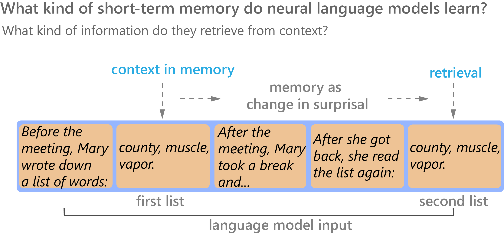

# Characterizing Short-term Memory In Neural Language Models



ArXiV preprint:  https://arxiv.org/abs/2210.13569

# Folder contents

- `./`         |  main scripts
- `/data`      |  scripts and .txt files for creating inputs
- `/models` |  code with subfolders that contain pytorch model classes and training scripts for awd_lstm and transformer.
- `/wm_suite` | code with script for evaluating and analysing models on the working memory test suite
- `/viz` |  .py script containing plotting subroutines (.ipynb notebook is not versioned)

# Dependencies

Dependencies are specified in the [main_env.yml](https://github.com/KristijanArmeni/neural-lm-mem/blob/main/awd-lstm_env.yml) and [awd-lstm_env.yml](https://github.com/KristijanArmeni/neural-lm-mem/blob/main/awd-lstm_env.yml) files for the transformer and awd-lstm code-bases, respectively.

We used the conda management toolkit, so the easiest way to create the environment with dependencies is as follows:

`conda env create -n your_env_name -f ./main_env.yml`

# Citation

```
@misc{https://doi.org/10.48550/arxiv.2210.13569,
      doi = {10.48550/ARXIV.2210.13569},
      url = {https://arxiv.org/abs/2210.13569},
      author = {Armeni, Kristijan and Honey, Christopher and Linzen, Tal},
      keywords = {Computation and Language (cs.CL), FOS: Computer and information sciences, FOS: Computer and information sciences},  
      title = {Characterizing Verbatim Short-Term Memory in Neural Language Models},
      publisher = {arXiv},
      year = {2022},
      copyright = {Creative Commons Attribution 4.0 International}
}

```

# Licence

